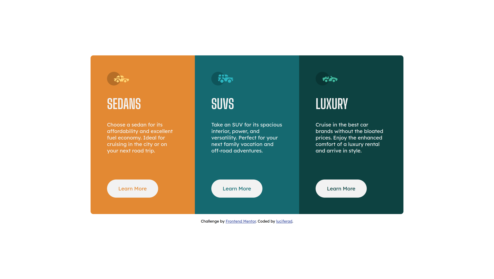

# Frontend Mentor - 3-column preview card component solution

This is a solution to the [3-column preview card component challenge on Frontend Mentor](https://www.frontendmentor.io/challenges/3column-preview-card-component-pH92eAR2-). Frontend Mentor challenges help you improve your coding skills by building realistic projects. 

## Table of contents

- [Overview](#overview)
  - [The challenge](#the-challenge)
  - [Screenshot](#screenshot)
  - [Links](#links)
- [My process](#my-process)
  - [Built with](#built-with)
  - [What I learned](#what-i-learned)
  - [Continued development](#continued-development)
  - [Useful resources](#useful-resources)
- [Author](#author)

## Overview

### The challenge

Users should be able to:

- View the optimal layout depending on their device's screen size
- See hover states for interactive elements

### Screenshot



### Links

- Solution URL: [Github](https://github.com/luciferad/3-column-preview-card-component-main)
- Live Site URL: [Github](https://luciferad.github.io/3-column-preview-card-component-main/)

## My process

### Built with

- Semantic HTML5 markup
- CSS custom properties
- Flexbox
- CSS Grid

### What I learned

In this project I learned that when I want to use border-radius for a grid container, I have to use it for gird container & grid component both. Because when you use border-radius for just the grid container, the grid component will be overflow the container & hide the border of the container.

To see how you can add code snippets, see below:

```css
.grid_container {
  border-top-left-radius: 2rem;
}
.grid_componenet_area1 {
  border-top-left-radius: 2rem;
}
```

### Continued development

I want to practice more on Grid & Flexbox. I want to work with them easily & fast. I belive that layout is the foundation of a nice web page.

### Useful resources

- [Learning Web Design](https://www.amazon.com/Learning-Web-Design-Beginners-JavaScript/dp/1491960205) - This book teaches me everything for begining. It's a good book for starting frontend development.
- [W3School](https://www.w3schools.com/) - This is a handy reference.

## Author

- Github - [@luciferad](https://github.com/luciferad)
- Frontend Mentor - [@luciferad](https://www.frontendmentor.io/profile/luciferad)